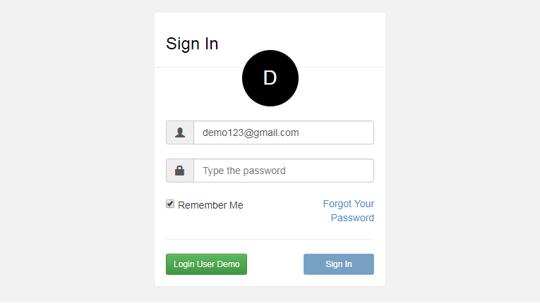

# Vue Login with an Avatar
Vue Login with an Avatar using Laravel Passport to access a Laravel API using CORS

## Functionality implemented
1. Code a Vue Login Form Component
2. Code a Avatar Component with this functionality
    * Search the email account in the gravatar service if exist display it
    * If email account is not found, show the first letter in uppercase as the avatar
    * if email account does not exist, display a question mark as the avatar
3. Integrate the Avatar Component to the Login Form Component
4. Install Laravel Passport
5. Interact with the Laravel API with Access Tokens using Laravel Passport
6. Implements CORS
### TODO
1. Send a Mail with a token to reset the username